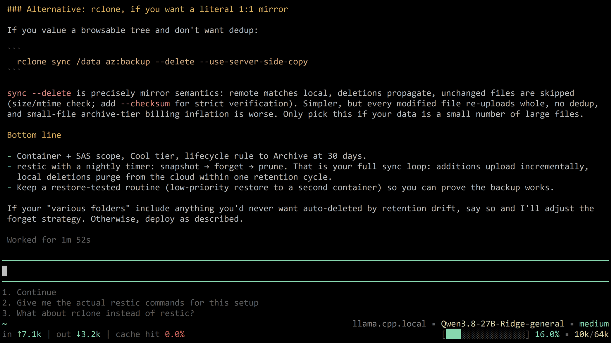

# Prompt Buffet documentation

## Table of Contents
- [About](#about)
- [Installation](#installation)
- [Settings](#settings)
- [Functionality](#functionality)
- [Related Files](#related-files)

## About

Prompt Buffet is a Pi extension that suggests what you are likely to type next. After every completed agent turn it asks a model to read the recent conversation and produce up to a few short, natural next prompts. Those suggestions appear in a numbered list directly below the input editor.

The goal is to shorten repetitive typing: continue a workflow, answer the assistant's question, commit, run tests, say "yes" - without composing each prompt from scratch. It is best-effort and designed to never interrupt normal use; if generation fails, nothing is shown and the session continues.

The extension is designed with purely TUI use in mind, it is skipped in RPC, JSON, and print modes.



Much thanks go out to [SteelDynamite/pi-prompt-suggestions](https://github.com/SteelDynamite/pi-prompt-suggestions) for the idea and the original clanker slop this particular clanker slop is built upon.

## Installation

Recommended - latest release From NPM:

(installs under: `~/.pi/agent/npm/node_modules/prompt-buffet/`)

```bash
pi install npm:@pi-sysadmin/prompt-buffet
```

You may also install by pointing `pi install` directly at this git repo, but since this implies potentially running bleeding edge untested code and more complicated versioning and update procedures, precise instructions are omitted. You should know how to do this if you really need it.

## Settings

### Command

`/prompt-buffet on|off` (Default: on)

Toggles the feature and persists the choice to the config file. The change applies from the next turn. With no valid argument, it reports the current state.

Config file: `~/.pi/agent/extensions/prompt-buffet.json`

The file is created automatically on first use with all defaults, and is resynced on load: missing keys are backfilled, and keys the extension no longer understands are removed. Invalid values are ignored (with a warning in the TUI) and the default is used.

| Key | Type | Default |
|-----|------|---------|
| `enabled` | boolean | `true` |
| `model` | string | `"default"` |
| `maxChars` | integer > 0 | `80` |
| `maxTokens` | integer > 0 | `1024` |
| `maxSuggestions` | integer 1-6 | `3` |

### Details

**`enabled`** (default: `true`)

Master switch for suggestion generation. Toggle from the TUI with `/prompt-buffet on|off`.

**`model`** (default: `"default"`)

Which model generates suggestions. When using a particularly heavy or expensive model, you might want to delegate suggestion generation to a secondary, more nimble model. Note that for models that support variable levels of reasoning, `"minimal"` is the hardcoded value for performance reasons.

- `"default"` (or any missing/invalid value): uses the model of the current session.
- `"provider/model"` (e.g. `"openai/gpt-5-mini"`): an explicit dedicated model, looked up in the session's model registry. Falls back to the session model if not found.

**`maxChars`** (default: `80`)

Hard cap on the length of a single suggestion; longer items are dropped. Also injected into the suggestion system prompt, so the model is told the limit up front.

**`maxTokens`** (default: `1024`)

Maximum output tokens the suggestion request may produce. If you intend to increase `maxSuggestions` you may want to increase this. Note that unlike `maxCandidates` and  `maxSuggestions` described below, this is more-of a safety valve and not a budget setting.

**`maxSuggestions`** (default: `3`)

How many numbered suggestions to show (1-6). The model is asked for a larger candidate pool, ranked most to least likely: the extension's internal system prompt `{maxCandidates}` placeholder resolves to `2 × maxSuggestions` (floored at 2). The extension then sanitizes the candidates, drops near-duplicates, and shows the top `maxSuggestions`.

### Example config

```json
{
  "model": "openai/gpt-5-mini",
  "enabled": true,
  "maxChars": 80,
  "maxTokens": 1024,
  "maxSuggestions": 3
}
```

## Functionality

### Generation

After each agent turn (the "agent_end" event), the extension:

- Skips generation if disabled, if messages are pending, or if the input editor already contains text.
- Assembles the most recent conversation (last 8 messages, truncated) as context.
- Calls a model with a dedicated suggestion system prompt and requests a JSON array of candidate prompts.
- Parses, sanitizes, and ranks the result, then shows it.

### Display

Suggestions render as a numbered list (1., 2., 3., ...) in a widget below the editor, dimmed text, one line each.

### Selection

- When the input editor is **empty**, pressing a number key (1-9) fills the editor with that numbered suggestion.
- Any normal edit keystroke (typing, backspace, delete, enter, tab) clears the suggestion list.
- Leaving the editor non-empty also suppresses new generations.

### Sanitization

Every candidate is cleaned before display:

- Markdown fences, stray quotes, and trailing periods removed.
- Items longer than `maxChars`, with newlines, or markdown artifacts are dropped.
- Praise, meta, and error phrasings are rejected ("done", "looks good", "thanks", "api error: ..." etc.).
- Items over 25 words are dropped.
- Single-word suggestions are only kept from a fixed allowlist (yes, sure, ok, continue, commit, deploy, stop, quit, ...) or if they start with "/" (commands).
- The first letter is capitalized.

### Suggestion rules

The built-in system prompt instructs the model to predict what the user would naturally type (not what they "should" do), continue the active workflow, answer the assistant's open questions with the top 1-2 plausible replies, avoid thanks/praise, avoid unrequested new ideas, and avoid unsafe or sensitive actions. It must reply with a plain JSON array of strings, or `[]` when nothing fits.

### Debugging

Set the environment variable `PROMPT_BUFFET_DEBUG=1` when starting Pi. Then each generation step is reported in the status line ("next-suggestions"), as info notifications, and appended to `prompt-buffet-debug.log` in the working directory. Useful for seeing why suggestions were skipped or rejected.

## Related files
The `...` is the extension's install root, see the [Installation](#installation) section.

- `~/.pi/agent/extensions/prompt-buffet.json`
  Your currently active [settings](#settings).

- `.../prompt-buffet/prompt-buffet.ts`
  The extension source.

- `.../prompt-buffet/prompts/suggestion-system-prompt.md` - the prompt used to generate suggestions. The prompt uses two placeholders, substituted at load: `{maxChars}` from the `maxChars` setting, and `{maxCandidates}` derived from `maxSuggestions x 2`. If the file is missing, a short built-in fallback prompt is used. Editing this file lets you tune suggestion style without touching code.

- `prompt-buffet-debug.log` (created in the working directory)
  Debug trace; only written when `PROMPT_BUFFET_DEBUG=1`.

---

*End of documentation*
